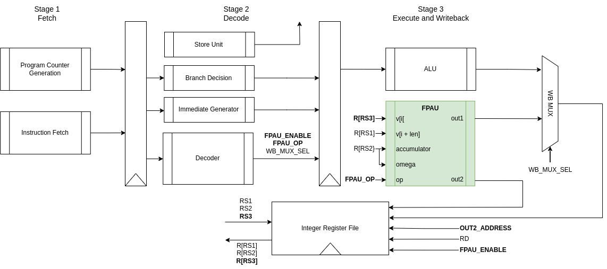
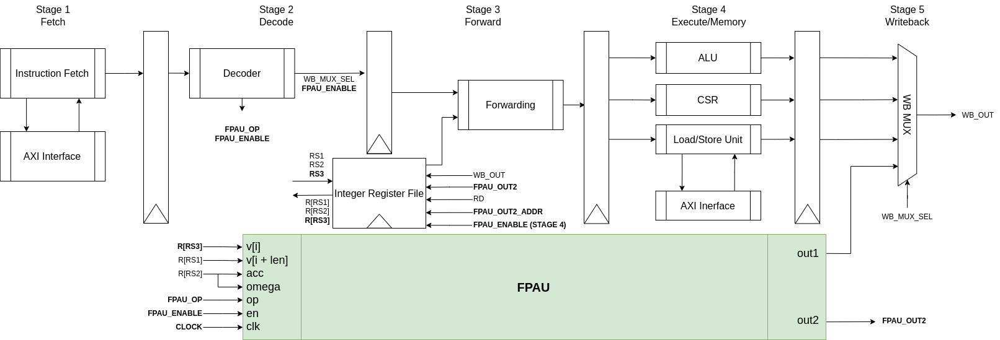

# RISC-V Cores

This folder contains the modified STEEL and ORCA RISC-V cores for the correct pipeline embedding of the FPAU. Within each core's Vivado project, the FPAU files are taken directly from the rtl folder. Details for each processor are described next.

## STEEL core

Relevant modifications, apart form the ones involving the insertion of the FPAU within stage 3 of the pipeline, are the following (all made in [hello_world.v](riscv-steel-core/hello_world/hello_world.v) file):
- Increased memory addresses bit size (14 to 17) to support up to 128 KB.
- Clock frequency to 35 Mhz (created custom clock and connected it to all modules, and changed clock_freq parameter for the UART module).

Following the core documentation, the next figure shows a simplified diagram of the STEEL core modules with the FPAU inserted within stage 3.

The modified signals are the following:

- **integer\_file\_write\_enable\_fpau**: Shown as FPAU\_ENABLE in the figure, this one-bit signal output by the decoder and input to the integer register file indicates if set to 1, to write the FPAU output values into the registers defined in the *instruction\_rd\_address* and *instruction\_rd2\_address* signals (shown as RD and OUT2_ADDRESS in the figure).
- **fpau\_operation\_code**: Shown as FPAU\_OP in the figure and also output by the decoder, this 4-bit signal contains the most significant bits of the *funct7* field of the instruction, which the FPAU uses to identify the operation to execute and the prime number to be used for the modular reductions.
- **instruction\_rs3\_address**: Shown as RS3 in the figure, this signal is used to input the address for a third output of the integer register file, which is extracted from the *rd* field of the FPAU instruction.
- **rs3\_data**: Shown as R[RS3] in the figure, this signal contains the value output by the integer register file, sent to the *a[i]* input of the FPAU.
- **instruction\_rd2\_address**: Shown as OUT2_ADDRESS in the figure, this signal is used to input the address for a second input of the integer register file, which is extracted from the *rs1* field of the FPAU instruction. Then, this signal contains the address to store the second output of the FPAU in the register file.
- **fpau\_output1**: Input to the writeback multiplexer, it contains the value to be stored into the register indicated by the *instruction\_rd\_address* signal, shown in the figure as RD.
- **fpau\_output2**: Input to the register file, it contains the value to be stored into the register indicated by the *instruction\_rd2\_address* signal, indicated as OUT2_ADDRESS in the figure.

### Simulation Instructions

After step 2 of the quick start guide in the [main README.md](../README.md), run the Simulate step in the Flow Navigator of the Vivado GUI. The [hello_world_behav.wcfg](riscv-steel-core/steel_fpau/hello_world_behav.wcfg) file already contains some useful core signals to monitor, as well as all the input and output signals of the FPAU. The [post.tcl](riscv-steel-core/steel_fpau/post.tcl) file already contains the needed reset and run instructions to start with a simulation already running the initial instructions of the simulated program, previously defined in the riscv-steel-core/hello_world/program.mem file. The default program is test_dilithium2.

## ORCA core

The original ORCA core contains a build configuration for the Zedboard. However, files in the /orca/systems/zedboard directory were modified to use the Zybo board, namely, [orca_system_cached.tcl](orca/systems/zedboard/orca_system_cached.tcl), [orca_system_cached_idram.tcl](orca/systems/zedboard/orca_system_cached_idram.tcl), [project.tcl](orca/systems/zedboard/project.tcl), and [orca_project.xpr](orca/systems/zedboard/orca_project/orca_project.xpr).

The next figure shows a simplified diagram of the ORCA core modules with the FPAU inserted within stages 2, 3, and 4.

The modified signals are the following:

- **fpau\_data\_out1\_DecToEx**: FPAU *rsum* output (shown as out1 in the figure), sent to the writeback multiplexer so that it can be selected to be written in the register file.
- **fpau\_data\_out2\_DecToEx**: FPAU *out2* output, kept in a register to add a one cycle delay to its writeback to the register file. 
- **fpau\_data\_out2\_ExToDec**: Delayed FPAU *out2* signal (one cycle). The delay is done to synthesize the register file with LUTRAM the same way as in the STEEL core (by doing one write per clock cycle to avoid using more than four input addresses).
- **execute\_to\_rf\_select2**: This signal, shown as FPAU_OUT2_ADDR in the figure, carries the address of the register where the *out2* FPAU output shall be written. 
- **fpau\_enable\_DecToEx**: This one-bit signal is the same as the *fpau\_enable* that is input to the FPAU, sent also to the execute stage to detect when the *rd* value (the *rsum* FPAU output) should be forwarded to a next instruction needing this result in *rs1*, *rs2* or *rs3*, which is usually a store word or another FPAU *mac* instruction.
- **execute\_to\_rf\_valid2**: This is a forwarding of the *fpau\_enable* signal to indicate the register file to write the FPAU *out2* result. The *execute\_to\_rf\_valid* signal already implemented in the ORCA design was also used to forward the *fpau\_enable* signal, but this one is specific for the *rsum* result. Both *execute\_to\_rf\_valid* signals are represented by FPAU_ENABLE (STAGE 4) in the figure.

### Simulation Instructions

For the hardware implementation, ORCA makes use of external DDR memory inserted in the Xilinx Zynq system. However, for simulation the program is loaded in an IDRAM memory for which a special build is defined in the [orca_system_cached_idram.tcl](orca/systems/zedboard/orca_system_cached_idram.tcl) file. To make this build, run the following commands in orca/systems/zedboard/:

    sudo make clean
    sudo make SIM_BUILD=1

The implementation step will fail since it will detect that the Zybo board does not support enough IDRAM, However, this is ok since the build is meant for simulation. 

After the previous build is finished, run the following command to open the Vivado GUI:

    sudo make sim SW_DIR=[sw_dir] TEST=[test_dilithium2|test_dilithium3|test_dilithium5]

with [sw_dir] as:
- ../../../../pqc_sw/dilithium/ref/test

Within the Vivado GUI tcl console, enter the following commands:

    reset_sim
    start_sim

The simulation should start with some predefined ORCA core signals and the FPAU inputs and outputs.

