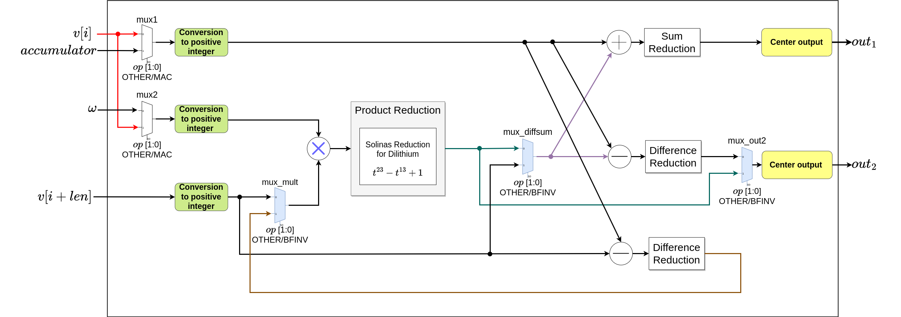

# RTL

This folder contains the register-transfer level design described with SystemVerilog code, with a top architecture in [fpau_top.sv](fpau_top.sv) and modular reduction submodules in [reduction_solinas_23_13.sv](reduction_solinas_23_13.sv) for CRYSTALS-Dilithium. A test bench for all instructions is also included in the [fpau_top_tb.sv](fpau_top_tb.sv) file, where a set of local parameters can be tuned to increase/decrease the coverage (needed for the trade-off with memory and execution time).

The FPAU top architecture is shown in the following diagram:

A complete list of inputs and outputs as named in the code is stated next.

## Inputs

| **Name** | **Description**                                       |
|:--------:|:-----------------------------------------------------:|
| CLK      | Clock signal (just used in multiple-cycles variant)   |
| en       | Enable signal                                         |
| op       | Operation (4 most significant bits of *funct7* field) |
| a0       | a[i] for *bf* and *bfinv*, coeff0 for *mac*           |
| a1       | a[i + len] for *bf* and *bfinv*, coeff1 for *mac*     |
| acc      | Accumulator for *mac*                                 |
| omega    | $\omega$ for *bf* and *bfinv*                         |

## Outputs

| **Name** | **Description**                                       |
|:--------:|:-----------------------------------------------------:|
| rsum     | First output of *bf* and *bfinv*, output of *mac*     |
| out2     | Second output of *bf* and *bfinv*, not used for *mac* |

## Instruction Set Extension

The assembly instruction format specified within the RISC-V compiler states the nomenclature *fpau.dil.y*, where *y* can take the values *mac*, *bf*, or *bfinv*. 

After the instruction definition, three arguments are needed in the following order: *rd*, *rs1*, and *rs2*. The following table shows a specific description of each instruction in Verilog syntax, where *R* represents the registers array.

|**FPAU instruction**| **Description of output 1**                | **Description of output 2**                  |
|:------------------:|:------------------------------------------:|:--------------------------------------------:|
| fpau.dil.mac       | R[rd] = (R[rd]*R[rs1] + R[s2]) \% 8380417  | NA                                           |
| fpau.dil.bf        | R[rd] = (R[rd] + R[rs1]*R[rs2]) \% 8380417 | R[rs1] = (R[rd] - R[rs1]*R[rs2]) \% 8380417  |
| fpau.dil.bfinv     | R[rd] = (R[rd] + R[rs1]) \% 8380417        | R[rs1] = ((R[rd] - R[rs1])*R[s2]) \% 8380417 |